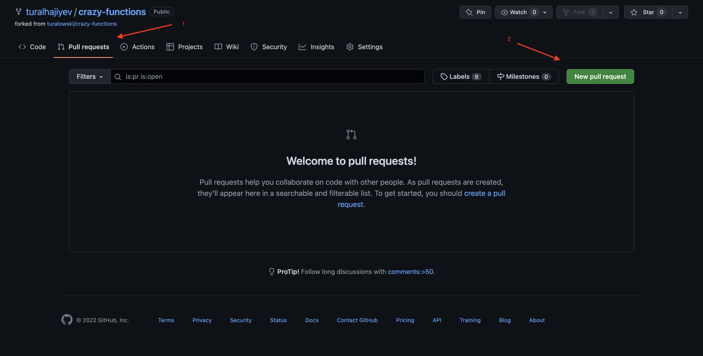
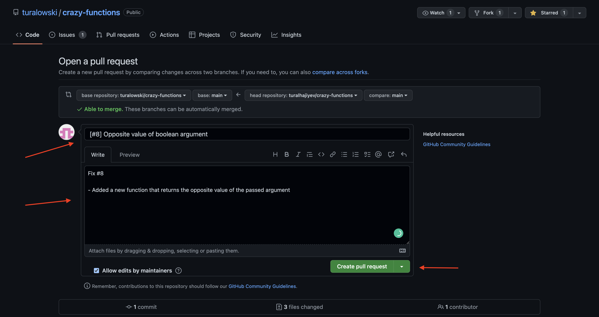

# Crazy Functions

[](https://opensource.org/licenses/MIT)

[](https://twitter.com/turalowski)

Read this in other languages: [Azərbaycan dili](README.md)

## General information

The main point of this project is to teach to junior and newbie developers how to work and contribute to open source codes.

**If you stuck in any step, it means that it haven't explained well. Don't hesitate to open [issue](https://github.com/turalowski/crazy-functions/issues/new) about it.**

If you follow all steps properly, you will have basic experience with followings:

1. How to create GitHub issue.
2. How to clone and fork GitHub project.
3. How to create Pull request.

**If it will be your first successful PR, you will be rewarded with different achievements by GitHub. You can see list of achievents [here](https://github.com/Schweinepriester/github-profile-achievements)**

**Before starting, be sure that node and git are setted up correctly on your machine**

## General structure of the project

```
.
├── __tests__
│   └── first-item-of-array.test.js (example)
├── src
│   └── first-item-of-array.js (example)
└── package.json
```

## Steps

1. Go to the [link](https://github.com/turalowski/crazy-functions) of project

2. Navigate to **Issues** on top bar


3. Click on **New issue**


4. Add title and description to the following inputs
   
 

For example, let's assume that you are planning to add function which calculates sum of 2 numbers. "Function to add 2 numbers" and "I'm planning to create a function which will receive 2 numbers as arguments and return sum of them" are relatant title and description for your issue. They are depend on your creativity, don't hesitate to have additions. (General design of function, possible test cases, etc.)

### 2. How to fork the project

1. Chose Fork from the top panel


2. Confirm to create fork


### 3. How to add changes

1. Copy the URL of forked project


2. Go to the directly that you want to clone the project in terminal

```
git clone {URL}
```

3. After clonning  `crazy-functions` directory is created (Name is by default). Open this folder in terminal

```
cd crazy-functions
```

4. Install packages

```
npm i -g yarn
yarn
```

5. To test that all packages are installed properly, run unit tests before making any code changes. If everything is fine, all tests should be passed.

``` 
yarn test
```

### 4. Create Pull request

1. Check that you are in project directory in terminal by using `pwd` command

2. Open your Code Editor and add your changes

3. After finishing your changes, check that everything is fine by running following commands

```
yarn test
yarn lint
yarn format
```

If you see any error happens, fix them before pushing changes.

4. Add main repository as remote.

```
git remote add --track main upstream https://github.com/turalowski/crazy-functions.git
git fetch upstream
```

5. Add changes and push changes to forked project

```
git add .
git commit -m "{Message for changes}"
git push -u origin main
```

6. Go to the forked project and select list Pull requests. From the new page click on "New pull request"  



7. You will see your changes in the new page. Left side is source (main branch in forked project) and right side is destination(main branch in main project). After being sure that everything is fine, click on "Create pull request"


8. Add title and description for PR request. Please add issue number to title and description inputs.


Your PR will appear in the list of "Pull requests" on the top panel. After testing and linting are passed, I will approve the PR and your amazing function will be added to main project.

If you reach to this point. it means you rewarded with GitHub achievements. __`Congratulations!`__
