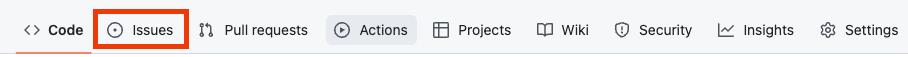
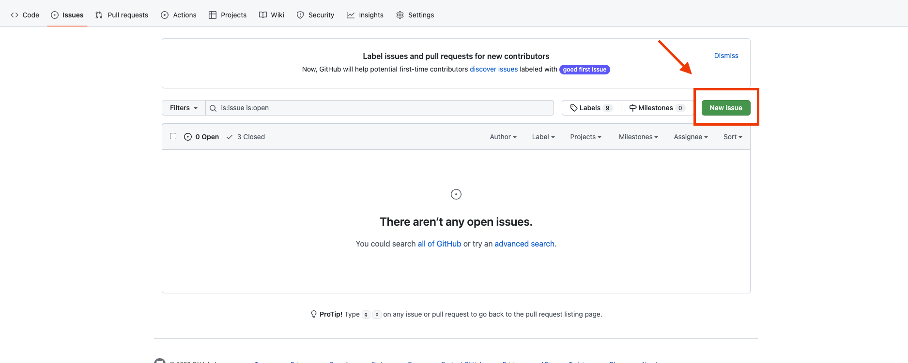
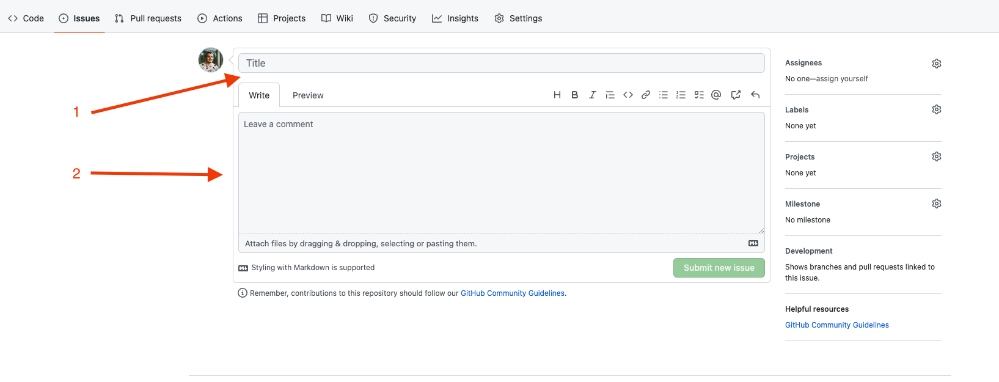
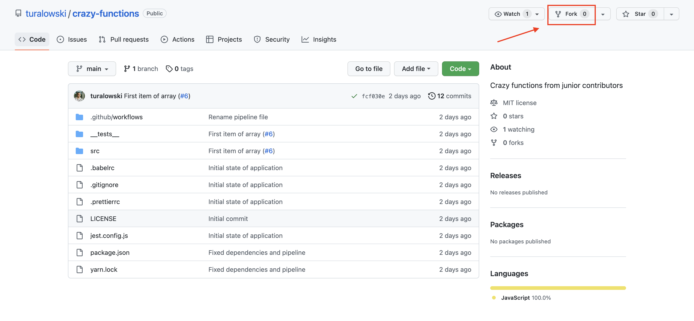
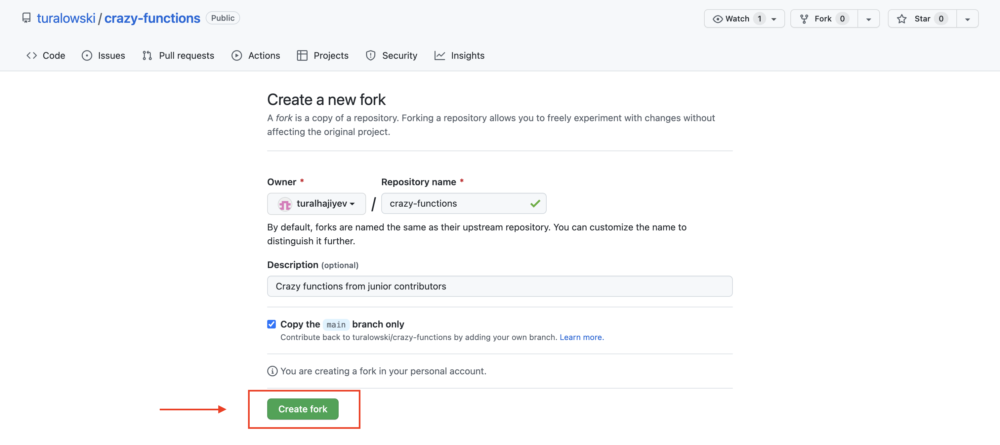
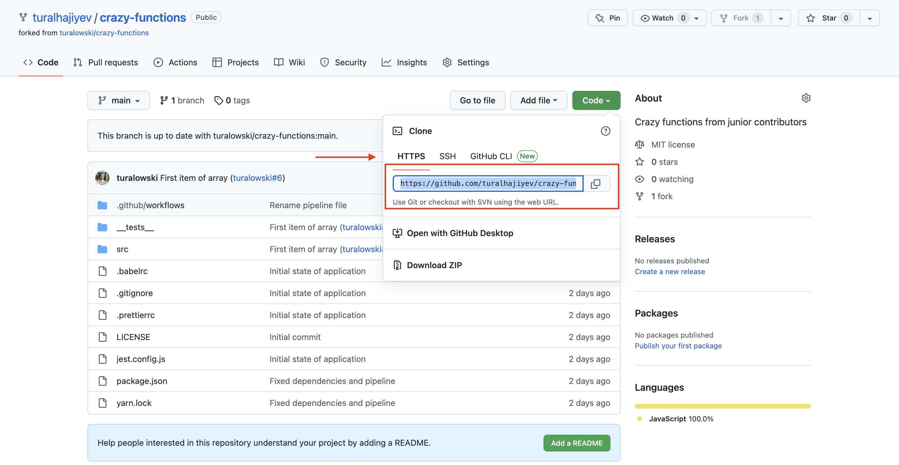
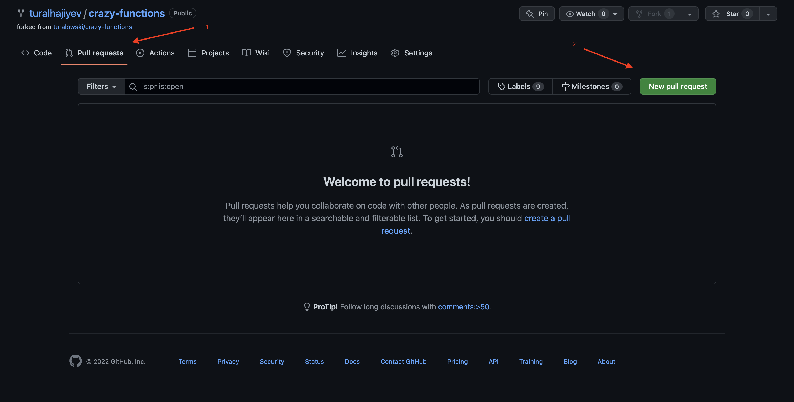
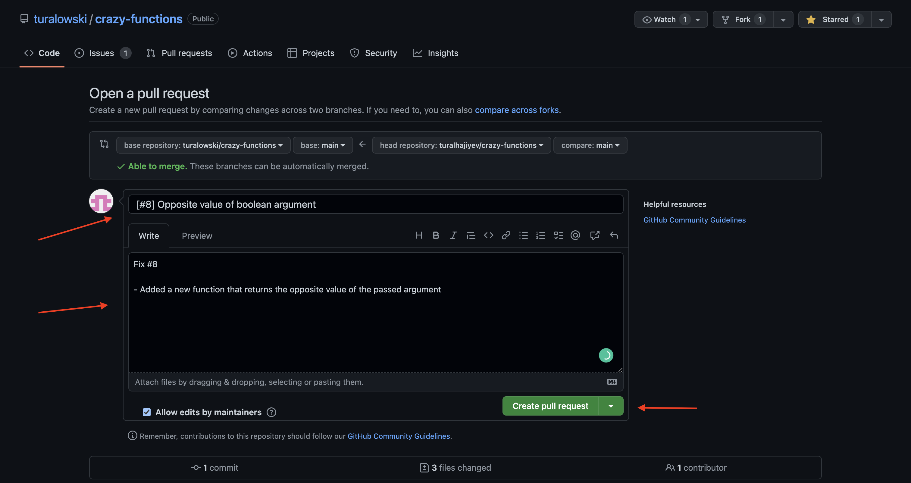

# Crazy Functions

[](https://opensource.org/licenses/MIT)

[](https://twitter.com/turalowski)

Digər dillərdə oxuyun: [English](README.en.md)

## Terminalogiya

| EN            | AZ               |
| ------------- | ---------------- |
| project       | layihə           |
| issue         | məsələ           |
| merge request | birləşmə sorğusu |
| branch        | budaq            |
| dependencies  | paketlər         |
| fork          | nüsxə            |
| clone         | kopyalamaq       |
| achievements  | mükafatlar       |
| directory     | qovluq           |
| open source   | açıq qaynaq      |

## Ümumi məlumat

Bu proyektin məqsədi, yeni başlayan və öyrənməkdə davam edən JavaScript developerlə açıq qaynaq kodlarla işləməyi və dəstək olmağı göstərməkdir. 

**Çətinlik çəkdiyiniz mərhələ olarsa deməli düzgün izah olunmayıb. Bununla bağlı [məsələ(issue)](https://github.com/turalowski/crazy-functions/issues/new) yaratmaqdan çəkinməyin**

Bütün mərhələləri izlədikdən sonra, aşağıdakı təcrübələriniz olacaq:

1. Github proyektlərində problem(issue) yaratmaq.
2. Proyekti kopyalamaq(clone) və nüsxəsini yaratmaq(fork).
3. Birləşmə sorğusu yaratmaq.

**Bu sizin ilk uğurlu birləşmə sorğunuz olacaqsa, github tərəfindən bir-neçə mükafatlar əldə edəcəksiniz. Mükafatların siyahısı ilə [buradan](https://github.com/Schweinepriester/github-profile-achievements) tanış ola bilərsiniz.**

**Başlamazdan öncə kompyuterinizdə git və node-un qurulu olduğundan əmin olun**

## Proyektin ümumi strukturu

```
.
├── __tests__
│   └── first-item-of-array.test.js (nümunə)
├── src
│   └── first-item-of-array.js (nümunə)
└── package.json
```

## Mərhələlər

### 1. Problem(issue) yaratmaq


 1. Proyektin səhifəsinə [daxil olun](https://github.com/turalowski/crazy-functions)
 
 2. Problemlərin siyahısına daxil olun

 

 3. Yeni problem yaratmağı seçin
 

 4. Birinci xanaya uyğun ad, ikinci xanaya isə qısa məlumat daxil edin.

 
 
 * Yaxşı olar ki, problemin adını və məlumatı ingilis dilində qeyd edəsiniz.
 
 Məsələn, fərz edək ki, 2 ədədin cəmini hesablayan bir funksiya əlavə etmək istəyirsiniz. Birinci xanaya "Function to add 2 numbers" ikinci xanaya isə "I'm planning to create a function which will receive 2 numbers as argument and return sum of them" qeyd edə bilərsiniz. Problem adı və məlumat hissəsi sizin yaradıcılığınızdan aslıdır, əlavələr etməkdən çəkinməyin. (Funksiyanın ümumi dizaynı, teslərdə ola biləcək ehtimallar -  null, undefined və s.)


### 2. Proyektin nüsxəsini(fork) yaratmaq

1. Proyektin nüsxəsini yaratmağı (fork) seçirik
   


2. Nüsxəni təsdiq edirik (Confirm fork)



### 3. Dəyişiklikləri əlavə etmək

1. Yaratdığımız nüsxəninin adresini götürük



2. Proyekti kopyalamaq üçün terminalda istədiyimiz qovluğa daxil olub LINK-i kopyaladığımız adres ilə əvəzləyirik

```
git clone {LINK}
```

3. Olduğumuz qovluqda `crazy-functions` yaranacaq. Həmin qovluğu terminal üzərindən açırıq

```
cd crazy-functions
```

4. Paketləri yükləyirik

```
npm i -g yarn
yarn
```

5. Paketləri yüklədiyinizi yoxlamaq üçün testləri yoxlaya bilərsiniz. Hər şey düzgün olunubsa bütün testlər uğurlar keçməlidir

```
yarn test
```

### 4. Birləşmə sorğusu (Pull Request və ya PR) yaratmaq

1. Terminalda proyektin olduğu qovluqdan əmin olduqdan sonra (yoxlamaq üçün terminalda `pwd` komandasını istifadə edin) 

2. Qovluğu istifadə etdiyiniz editorda açın və dəyişiklikləri əlavə edin.

3. Dəyişiklikləri etdikdən sonra hər şeyin düzgün olduğunu aşağıdakı əmrlərlə yoxlayın:

```
yarn test
yarn lint
yarn format
```

Xəta baş verərsə kodu buluda yükləməzdən öncə xətaları həll edin.

4. Əsas repositoriyanı original repositoriya kimi əlavə edin

```
git remote add --track main upstream https://github.com/turalowski/crazy-functions.git
git fetch upstream
```

5. Dəyişiklikləri yadda saxlayın və nüsxəsini çıxardığınız proyektə əlavə edin

```
git add .
git commit -m "{Əlavə etdiyiniz dəyişikliklərlə bağlı qısa mesaj}"
git push -u origin main
```

6. Sizin GitHub profilinizdə yerləşən proyektin nüsxəsinə daxil olub yuxarı paneldən Pull sorğuların siyahısını seçin. Açılan yeni pəncərədən sağdakı yaşıl butona tıklayın.



7. Açılan pəncərədə default olaraq sizin etdiyiniz dəyişikliklər görünəcək Qısaca yuxarı paneldə sağdakı hissə dəyişikliklərin olduğu (sizin nüsxəsini götürüb öz adınız altında yaratdığınız proyekt) soldakı yer isə dəyişiklikləri birləşdirmək istədiyiniz yeri bildirir.
Hər şeyin düzgün olduğuna əmin olduqda "Create pull request" seçib birləşməni təsdiq edə bilərsiniz.



8. Birinci xanaya yeni birləşmə sorğusuna uyğun ad, ikinci xanaya birləşmə sorğusu barədə qısa məlumat daxil edin. Problem nömrəsini birləşmə sorğusunun məlumat hissəsində qeyd etməniz arzu olunandır. 


Etdiyiniz birləşmə yuxarı paneldəki "Pull Requests" xanasında görünəcək. Birləşmə sorğusu testləri keçdiyi zaman mən qəbul edəcəm və sizin kod dəyişiklikləri əsas proyektə birləşəcək.

Bu mərhələyə qədər gəldinizsə GitHub tərəfindən sizin hesaba yeni nailiyyətlər veriləcək. __`Təbriklər`__